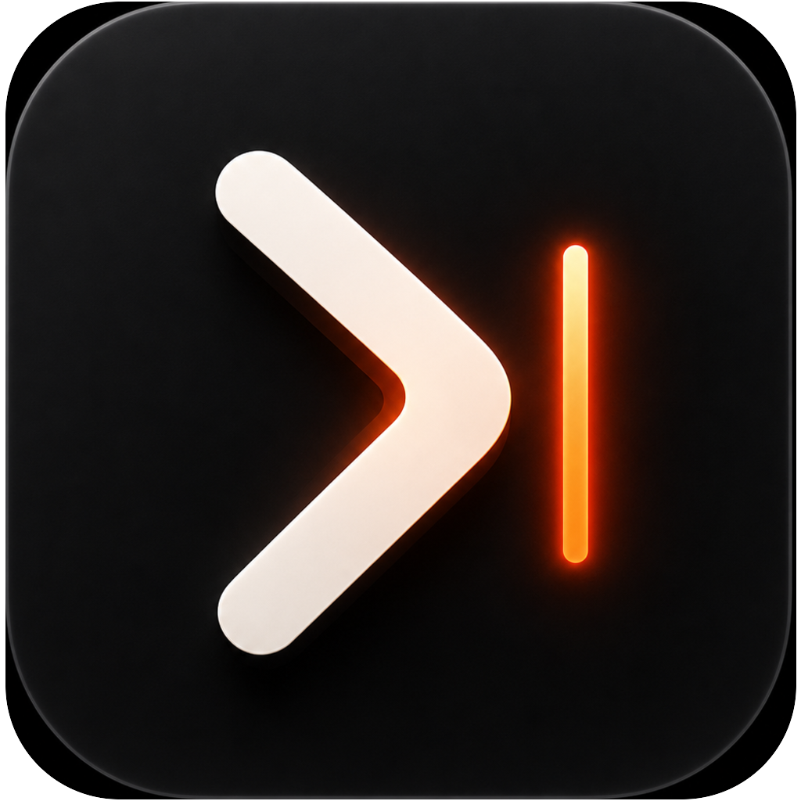
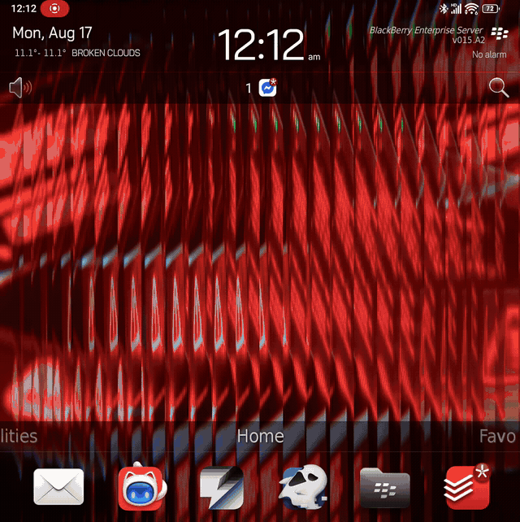
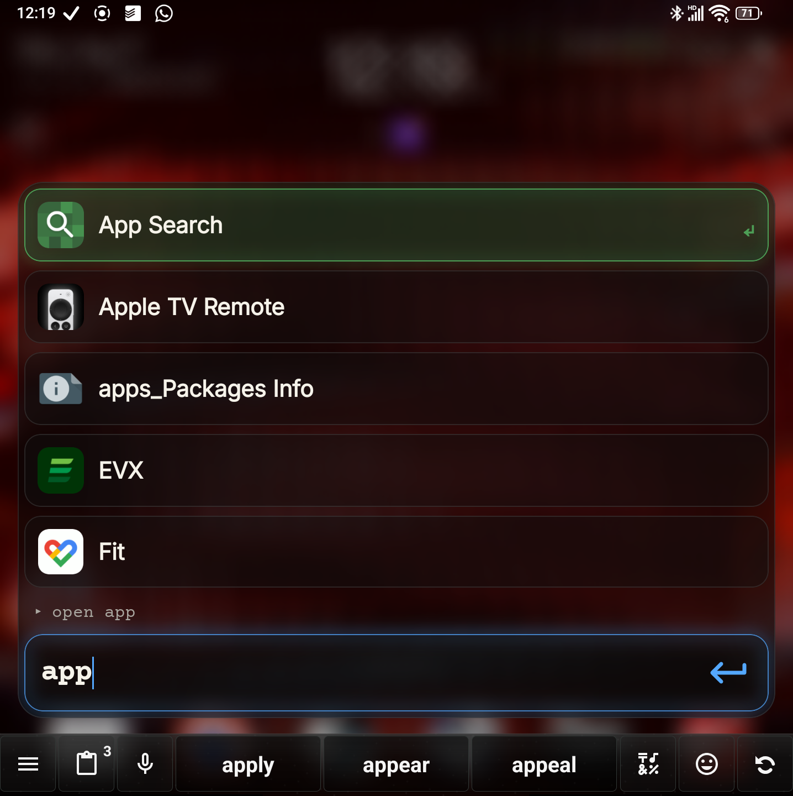
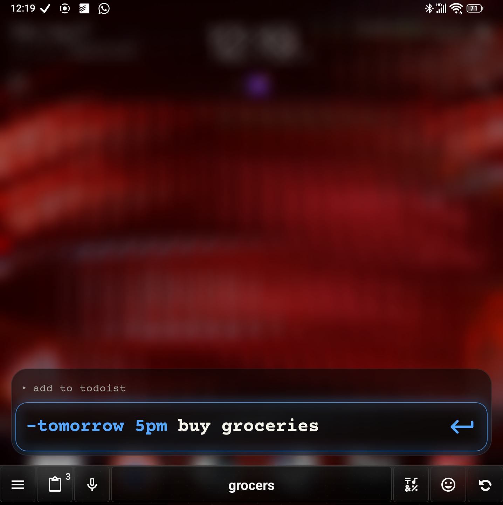
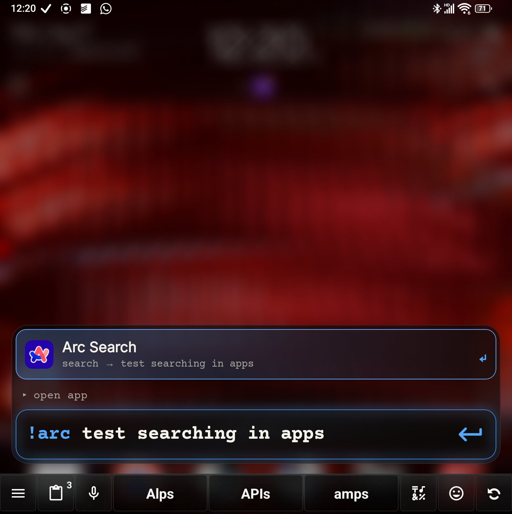
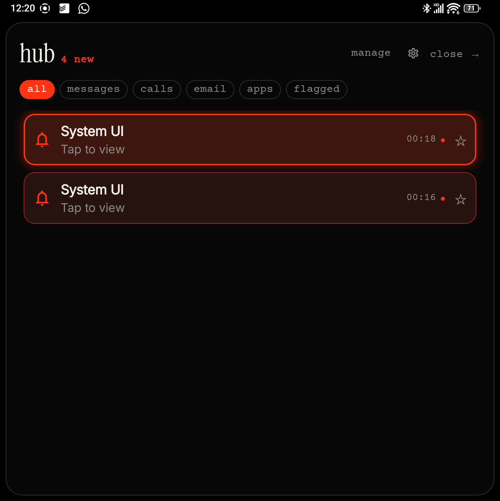
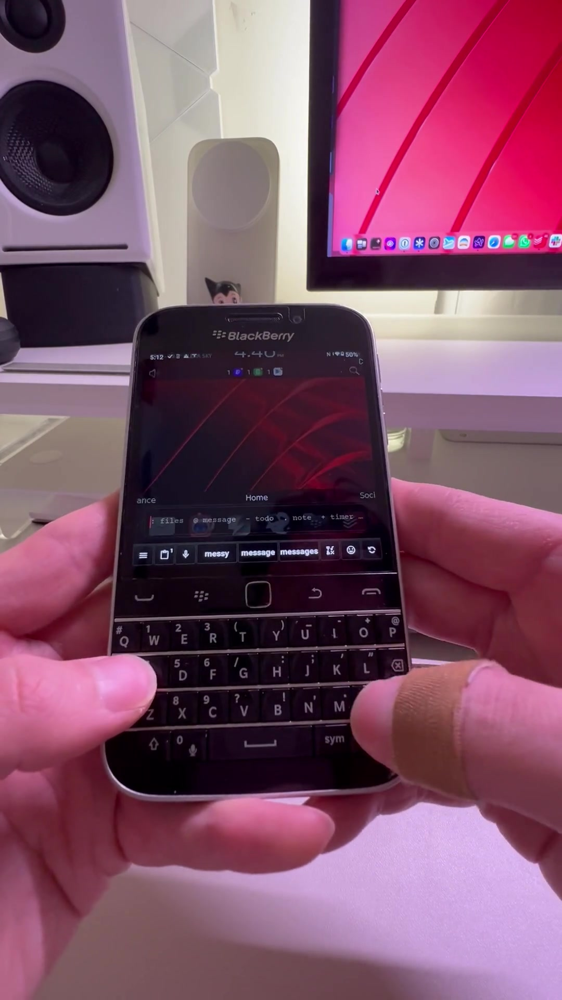

<p align="center">
  
</p>

<h1 align="center">Commander</h1>

<p align="center">
  A fast, keyboard-first command bar and notification hub for Android.
</p>

<p align="center">
  <a href="https://ko-fi.com/astroboii47">
    
  </a>
</p>

> [!IMPORTANT]
> Commander is alpha software. Features may change, and some integrations depend on the Android version, device firmware, launcher, keyboard, and installed apps.

## What it does

Commander puts common Android actions behind one searchable overlay. Open the bar from a hardware key, launcher gesture, shortcut, or optional home-screen typing, then type what you want to do.

- Search installed apps and launcher shortcuts.
- Add Todoist tasks with natural-language date and time recognition.
- Search files and folders, with optional previews and sorting.
- Start timers, calculate expressions, and convert common units.
- Search contacts for calls and messages.
- Open configurable searches in Maps, YouTube, Spotify, Reddit, Play Store, and other apps.
- Run selected Tasker tasks.
- Ask Gemini in the overlay or continue a query in ChatGPT.
- Read, filter, dismiss, open, and reply to supported notifications in Commander Hub.
- Customise accent colour, blur, glow, app-result animation, and interface sounds.

Commander is designed for speed and physical-keyboard devices first. It also works on conventional Android phones and can be operated by touch, but its shortest workflows are built around typing and keyboard navigation.

## Why Commander exists

Commander began as a passion project after I could not find the fast, keyboard-centric command palette I wanted on Android. I was also tired of seeing useful everyday workflows divided between subscriptions and paid apps. A tool that can make every interaction with a phone faster should be available to everyone, so Commander is open source.

The renewed interest in keyboard phones gives me hope that we can have more choice, not only in the devices we carry, but in the software designed for them. I still find it remarkable that devices like the Titan 2 and Q25 exist at all. I hope Commander makes them, and Android phones generally, just a little faster and more fun to use.

This project can only improve as a group effort. Testing, device reports, ideas, fixes, and thoughtful feedback are all valuable, especially from people using hardware and workflows I do not have access to.

## See Commander in action

<p align="center">
  
  <br>
  <sub>Fast app search from a physical keyboard.</sub>
</p>

<table>
  <tr>
    <td align="center"><br><sub>Fast app search</sub></td>
    <td align="center"><br><sub>Recognised Todoist dates and times</sub></td>
  </tr>
  <tr>
    <td align="center"><br><sub>Configurable app aliases</sub></td>
    <td align="center"><br><sub>Commander Hub</sub></td>
  </tr>
</table>

<p align="center">
  <a href="https://github.com/astroboii47/Commander/releases/download/untagged-342a3d7e3da1847d7643/commander-in-hand.mp4">
    
  </a>
  <br>
  <sub>Select to watch the full in-hand walkthrough.</sub>
</p>

## Tested devices

Most development and testing has been done on:

- Unihertz Titan 2
- Zinwa Q25

Commander should work on other Android phones, including other keyboard phones, but hardware-key handling and background-launch behaviour vary between manufacturers. If you test another device, please [open a compatibility report](../../issues/new?template=bug_report.yml) with the model, Android version, keyboard, launcher, and what worked or failed.

## Tested integrations

The first alpha has been developed and personally tested primarily with:

- **Todoist** for tasks
- **Google Calendar** for calendar events
- The device's **default Clock app** for timers
- **Pastiera Enhanced** as the physical-keyboard input method
- **Solid Explorer** for file and folder results
- **Gemini API** for in-bar AI and **ChatGPT** for app hand-off
- **WhatsApp** and **Facebook Messenger** for supported notification replies and messaging workflows

Other apps may work when they expose compatible Android intents, shortcuts, or notification actions, but they have not received the same level of testing yet.

## Install and set up

1. Download the APK from the latest GitHub release.
2. Allow installation from the app you used to download it, then install Commander.
3. Open **Commander Settings**.
4. Configure only the permissions and integrations you intend to use.
5. Add **Commander Bar** to a hardware key, launcher gesture, or automation app.

Android may block Accessibility for manually installed apps until **Allow restricted settings** is enabled from Commander’s Android app-info page. Commander Settings provides direct links to both app info and Accessibility.

See the [complete setup guide](docs/SETUP.md) for notification access, home typing, files, contacts, Todoist, Gemini, Tasker, root assistance, and keyboard shortcuts.

## Default commands

| Input | Action |
| --- | --- |
| normal text | Search installed apps |
| `Space` | Search files and folders |
| `@` | Message a contact |
| `#` | Call a contact |
| `-` | Add a task |
| `!` | Create a note |
| `*` | Create a calendar event |
| `+` | Start a timer |
| `,` | Calculate or convert units |
| `/` | Search the web |
| `?` | Ask Gemini in Commander |
| `??` | Continue in ChatGPT |

The note and file triggers are configurable. Search aliases can also be assigned to supported apps and services.

## Commander Hub

Commander Hub uses Android’s notification-listener interface to collect active notifications into one keyboard-friendly view. It supports category filters, unread highlighting, dismissing notifications, opening their original destination, and inline replies when the originating app exposes an Android direct-reply action.

Reply support is determined by the notification. Some apps or notification types do not provide a reply action, and grouped notifications may expose only a summary.

Messaging integrations have additional Android and app-level constraints. WhatsApp and Messenger contacts cannot be queried as freely as ordinary device contacts. Exact-chat opening and quick replies therefore depend on conversation shortcuts, a live reply-capable notification, or an intent exposed by the installed app. Commander cannot guarantee silent background sending, and some flows may still require confirmation inside the messaging app.

## Permissions and privacy

Commander has no advertising or analytics SDK. Data is processed locally except when you explicitly use a feature that contacts an external service, such as Gemini, Todoist, or a web/app search.

Powerful permissions are optional and feature-specific. Notification access, Accessibility, contacts, SMS, full-file access, and root assistance should be enabled only if you use the corresponding feature. Gemini and Todoist credentials are encrypted with Android Keystore before being stored.

Read [PRIVACY.md](PRIVACY.md) for the complete data and permission explanation.

## Current alpha limitations

- Home-screen typing depends on the active launcher and device keyboard handling.
- Blur support varies by device and firmware.
- Messaging-app automation depends on the intents, shortcuts, notifications, or reply actions exposed by those apps.
- File access and folder opening can vary by file manager and Android storage implementation.
- Root-assisted Accessibility persistence is optional and device-specific.
- Commander Home remains experimental and is hidden from the alpha launcher build.

## Roadmap

These are directions for future releases rather than promises or fixed deadlines:

- Finish Commander Home as an optional launcher experience that can reduce reliance on Accessibility for home-screen typing.
- Expand custom command triggers.
- Simplify Settings and build a clearer first-run onboarding flow.
- Support more task and calendar apps.
- Add more configurable search providers and app-search integrations.
- Expand quick-reply support across messaging apps.
- Improve contact and conversation lookup.
- Support more AI providers through bring-your-own-key integrations and app-intent hand-offs.
- Improve blur on unsupported Android builds and deepen integration where device firmware permits it.

## Build from source

Requirements:

- JDK 17 or newer
- Android SDK 36

```bash
./gradlew assembleDebug
```

The debug APK is written to `app/build/outputs/apk/debug/`.

API keys, signing keys, `local.properties`, and machine-specific paths are not part of the repository.

## Contributing

Device reports, focused bug reports, and small pull requests are welcome. Please read [CONTRIBUTING.md](CONTRIBUTING.md) before submitting changes.

## Support development

Commander is an open-source passion project. If it makes your phone faster or a little more fun to use, you can help support continued development:

<p>
  <a href="https://ko-fi.com/astroboii47">
    
  </a>
</p>

## Licence and attribution

Commander is released under the [MIT License](LICENSE). Third-party software and font notices are listed in [NOTICE.md](NOTICE.md).

Commander is an independent project. It is not affiliated with, endorsed by, or sponsored by The Minimal Company Inc. or the makers of the third-party apps and services it can open.
